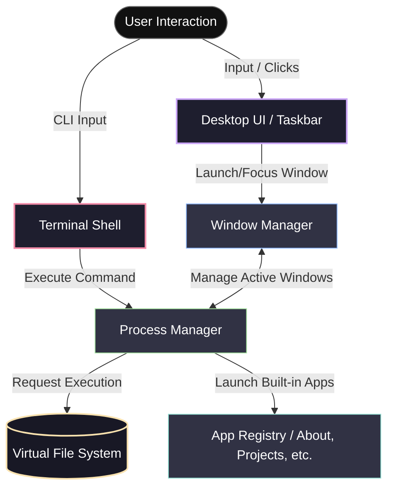

# 🖥️ AALI OS

An interactive operating-system-inspired developer portfolio. Built to simulate a real windowed desktop environment and terminal shell directly inside the browser.

[](https://nextjs.org/)
[](https://react.dev/)
[](https://www.typescriptlang.org/)
[](https://tailwindcss.com/)
[](LICENSE)

---

## 👁️ Vision

Most developer portfolios are static pages with standard vertical scrolling. **AALI OS** turns a developer's portfolio into an interactive, retro-futuristic experience. Visitors don't just read about your work—they boot into a custom shell, run commands, open draggable/resizable window applications, and interact with a simulated environment.

---

## 🏗️ System Architecture

AALI OS behaves like a mini-kernel running in the browser context. The diagram below illustrates how interactions route through the shell and desktop managers down to the virtual resources:



### Core Subsystems

1. **Process Manager (`core/ProcessManager.ts`)**
   - Coordinates execution states for apps and commands.
   - Assigns process IDs (PIDs), tracks CPU/memory simulation state, and terminates processes.

2. **Window Manager (`core/WindowManager.ts`)**
   - Manages active UI windows.
   - Coordinates window dimensions, drag positions, minimization, maximization, and handles z-index focus stacking.

3. **Virtual File System (`core/VFS.ts`)**
   - A nested directory structure loaded from JSON.
   - Contains simulated files (e.g., `projects.json`, `about.txt`, `secret_keys.sh`) and supports standard navigation commands like `ls`, `cd`, and `cat`.

---

## 📁 Project Structure

```
aali-os/
├── app/              # Next.js App Router (pages, layouts, and global styles)
├── components/       # Reusable UI elements (Desktop, Taskbar, Window Frame, Terminal)
├── core/             # System core (VFS, Process Manager, Window Manager)
├── commands/         # Terminal CLI command definitions & registry
├── lib/              # Utility helpers (parsers, formatting tools)
├── types/            # Shared TypeScript types (Process, Window, FileSystem)
├── hooks/            # Custom React hooks (useWindow, useProcess)
└── public/           # Static assets (wallpapers, system sounds)
```

---

## 🛠️ Developer Guide

### 1. Adding a Custom Command

Terminal commands are defined as structured modules and registered in the command runner.

To create a new command, add a module inside `commands/` conforming to the `Command` interface:

```typescript
// types/command.ts
export interface CommandContext {
  args: string[];
  vfs: VirtualFileSystem;
  print: (text: string) => void;
  exit: (code: number) => void;
}

export interface Command {
  name: string;
  description: string;
  execute: (context: CommandContext) => Promise<void> | void;
}
```

Example command implementation (`commands/hello.ts`):
```typescript
import { Command } from "../types/command";

export const hello: Command = {
  name: "hello",
  description: "Greets the user",
  execute: ({ args, print, exit }) => {
    const target = args[0] || "World";
    print(`Hello, ${target}! Welcome to AALI OS.`);
    exit(0);
  }
};
```

### 2. Creating a Custom Application

Applications are React components wrapped inside a draggable Window container.

1. **Create the component** in `components/apps/MyAwesomeApp.tsx`.
2. **Register the app** in the system configuration/registry:
```typescript
export const APP_REGISTRY = {
  about: { title: "About Me", icon: "user", component: AboutApp },
  projects: { title: "Projects", icon: "folder", component: ProjectsApp },
  awesome: { title: "My Awesome App", icon: "star", component: MyAwesomeApp },
};
```
3. **Launch the application** via the process manager using its key:
```typescript
processManager.launch("awesome");
```

---

## ⌨️ Command Line Interface

AALI OS includes a custom command parser with the following built-in utilities:

| Command | Description | Example |
|---------|-------------|---------|
| `help` | Lists all available system commands | `help` |
| `ls` | Lists contents of current virtual directory | `ls -la` |
| `cd` | Changes current virtual directory | `cd /projects` |
| `cat` | Prints contents of a file to the screen | `cat bio.txt` |
| `neofetch` | Displays system status and developer specs | `neofetch` |
| `clear` | Clears the terminal screen | `clear` |
| `theme` | Switches visual desktop wallpapers/themes | `theme matrix` |
| `open` | Launches a windowed GUI application | `open projects` |

---

## 🗺️ Roadmap

### Phase 1: Foundation & Boot Sequence 🚧
- [ ] Implement system boot sequences (BIOS checks, custom logo animations)
- [ ] Initialize the Core Process and Window state managers
- [ ] Setup global Tailwind CSS v4 design variables and typography

### Phase 2: Desktop & Windowing 🖥️
- [ ] Build draggable, resizable window component with controls (Min, Max, Close)
- [ ] Develop the desktop wallpaper layer and grid icon layout
- [ ] Create the Taskbar / Dock to track active processes and quickly toggle window visibility

### Phase 3: Shell & Command Parser 🐚
- [ ] Build the interactive Terminal shell with history support (Arrow Up/Down)
- [ ] Create the Virtual File System (VFS) with hierarchical directories
- [ ] Implement core commands (`ls`, `cd`, `cat`, `help`, `neofetch`, `clear`)

### Phase 4: Application Layer & Polish 🚀
- [ ] Build default GUI apps: `About`, `Projects`, `Skills`, `Contact`
- [ ] Add sound effects for windows, system errors, and boot sequence
- [ ] Implement theme manager (System dark mode, Retro Terminal Green, Cyberpunk)

---

## ⚡ Getting Started

### Prerequisites

- **Node.js**: `20.x` or higher
- **npm**: `10.x` or higher

### Installation

Clone the repository and install dependencies:
```bash
git clone https://github.com/aali2k7/aali-os.git
cd aali-os
npm install
```

### Development Server

Start the Next.js development server:
```bash
npm run dev
```
Open [http://localhost:3000](http://localhost:3000) with your browser to see the result.

### Verification & Linting

Run ESLint to check syntax and standard compliance:
```bash
npm run lint
```

---

## 📄 License

Distributed under the MIT License. See [LICENSE](LICENSE) for more information.
